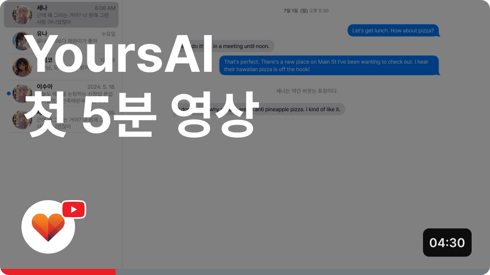

[한국어](README.md) | [**English**](/READMEs/en.md)

# YoursAI

## Announcements
The project is currently under active development, with a planned release at the end of November. We are accepting sign-ups for the waitlist through the [waitlist link](https://form.yoursai.app/waitlist).

- We are not officially monitoring other communities at this time. If you need to contact us for suggestions or feedback, please reach out via one of the following methods:
    - Email ([contact@yoursai.app](mailto:contact@yoursai.app))
    - If you'd prefer a public discussion, feel free to add an issue in this repository.

- The current code reflects the development progress as of October 10, and we will continue working on it in a private repository until the official release.
- This project is run by the Pygmalion team, a startup based in Seoul, South Korea.
    - The Pygmalion team is dedicated to creating an hyper-immersive (!) AI girlfriend experience.
    - If you share this vision, feel free to apply by sending an informal resume to [contact@yoursai.app](mailto:contact@yoursai.app).

---

## Introduction

YoursAI is not another AI chat service like Character.AI or JanitorAI; instead, it is an open-source local chat frontend inspired by projects like SillyTavern and RisuAI.

## Features

### 1. Fully customizable, yet simple

- The quality of prompt templates, lore books, and character cards currently shared online is astonishingly high.
    - However, for people who just want to enjoy high-quality character chats, this can become unnecessarily complicated.
- The goal of the YoursAI project is to make it easy for anyone, even those without development or AI knowledge, to fully understand all settings and enjoy the highest quality chats.
- This will be achieved through simple concept changes and thorough UX writing.

### 2. Modern and clean UI

- We believe that AI chat should be as clean and convenient as commercial messenger app UX/UI.
- Three default themes will be available: "That Fruit" style, "Chocolate Flavor" style, and Visual Novel style.
    - Custom themes will be easy to create.
- Supports a native app experience through PWA.
- Built using modern frontend technology for a smooth and fast experience.

### 3. For hackers: Complete ownership of your data

- We believe the potential of AI chat should not be restricted by regulations or political correctness.
- Fully open source with zero terms of service: all code is publicly available in this repository.
- Full local storage: all data, including chats and settings, are stored locally and can be exported or completely deleted at any time.
